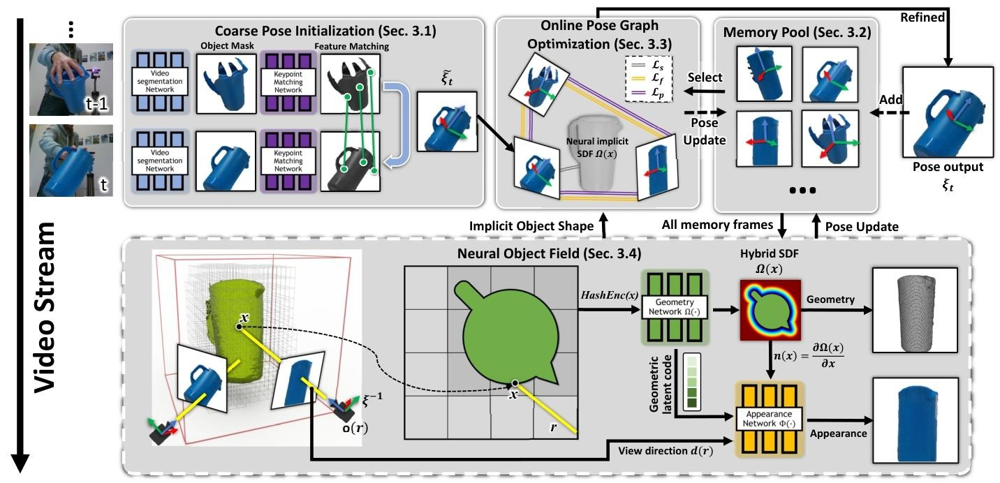

# BundleSDF: Neural 6-DoF Tracking and 3D Reconstruction of Unknown Objects
#### Paper: https://arxiv.org/pdf/2303.14158 
#### Code: https://arxiv.org/pdf/2303.14158](https://github.com/NVlabs/BundleSDF

## Abstract 
- 用于从单目RGBD视频序列中对未知物进行6自由度跟踪，同时进行神经三维重建。 
  - 特点：神经物体场和位姿图优化过程同步学习。 
  - 作用：将信息累计成一个一致的三维表达，同时捕捉了物体的几何形状和外观特征。 
  - 实现方法：维护一个包含位姿信息的动态记忆帧池，用于促进处理流程之间的信息交互。

## Introduction 
- 出发点&问题：CV邻域中两个基本且紧密相关的问题，其一为从单目RGBD视频中对未知物体进行6自由度位姿跟踪，其二为对该物体进行三维重建。然而之前的方法通常假定相机位姿已知或真实的掩膜已知，此外，动态移动的相机捕捉静止物体时，无法实现完整的三维重建，实时的6自由度物体位姿估计与跟踪方法通常需要获取物体的带有纹理的三维模型进行预训练或在线模板匹配。
- 解决方案：假定物体是刚性的，并且需要视频第一帧中的二维物体掩膜，除了这两个要求之外，物体可以自由移动，乃至严重遮挡。一个在线位姿图优化过程、一个用于重建三维形状和外观的并行神经物体场，以及一个促进这两个过程之间信息交互的记忆池。
- 引入了一种混合符号距离函数（SDF）表示法，以应对在以动态物体为中心的场景中，因特别问题所导致的不确定自由空间问题，例如存在噪声的分割结果以及因交互产生的外部遮挡。

## Conclusion
- 是一种从单目RGBD视频中进行6自由度物体跟踪和三维重建的新方法。仅需在初始帧对物体进行分割，通过并行运行的两个线程分别执行在线图优化姿态估计和神经物体场表示，应对诸如快速运动、部分和完全遮挡、缺乏纹理以及镜面高光等挑战性场景。

## Related Work
- 自由度物体姿态估计与跟踪
  - 利用第一帧姿态估计，另外利用时间信息来估计视频中每一帧的物体姿态。
- 同时定位与建图（SLAM）
  - 静态：跟踪相机相对于一个大型静态环境的姿态
  - 动态：通过结合颜色信息的帧模型迭代最近点（ICP）算法、概率数据关联或三维水平集最大化来跟踪动态物体。通过将新跟踪到的姿态与g观察到的RGBD数据聚合，模型会即时进行重建。
  - 本论文方法：利用神经物体场表示，专注于物体中心的设置，能够自动即时融合，同时修正历史跟踪姿态以保持多视图统一性。
- 物体重建
  - 不假设已知相机姿态或真实分割，无需专注在具有丰富纹理或几何线索的静态场景，此方法按照视频流的顺序依次进行处理，不假设对交互主体的特定知识，保证了泛化性。

## Approach
- 1. 粗略姿态初始化:
  - 通过利用一个与物体无关的视频分割网络，计算当前帧 $F_t$ 和前一帧 $F_t-1$ 之间的粗略物体姿态估计 $\tilde{\xi}_t \in SE(3)$ ，然后通过基于Transformer的特征匹配网络，在 $F_t$ 和 $F_t-1$ 之间建立RGB特征对应关系，注意到此网络已经在大量互联网照片上进行预训练的，识别到的对应关系通过基于RANSAC的姿态估计器，采用最小二乘法进行过滤，然后选择能够最大化内点数目的姿态假设作为当前帧的粗略姿态估计 $\tilde{\xi}_t$ 。  
e.g.,RANSAC:随机样本一致性算法：通过反复选择子集并估计模型来去除异常值的方法。  

